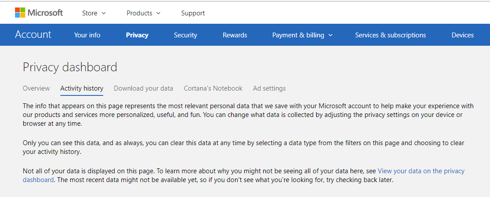
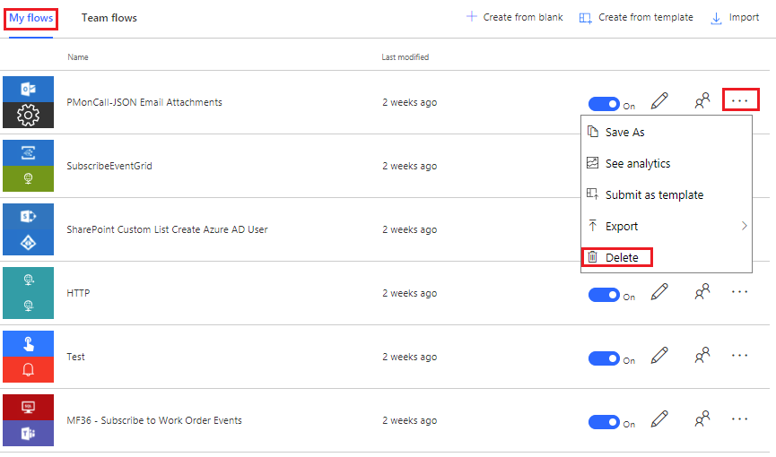
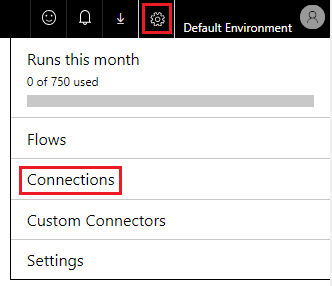
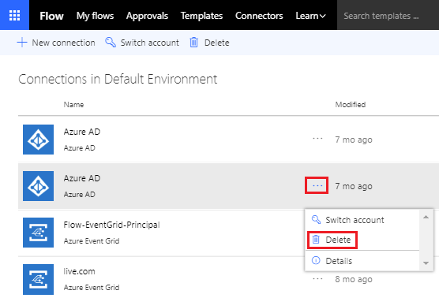

# Responding to GDPR Data Subject Delete Requests for Microsoft Flow - Microsoft Accounts (MSA)

The “right to erasure” by the removal of personal data is a key protection in the GDPR. Removing personal data includes removing all personal data except audit log information.

Microsoft Flow allows users to build automation workflows. When a user decides to delete their personal data from Microsoft Flow, they have the ability to manually review and determine whether or not to delete certain data and resources that they have created. 

The following table shows which personal data is automatically deleted and which data requires an administrator to manually review and delete:

|Requires manual review and deletion|Automatically deleted|
|------|------|
|Product and service activity|Run history|
|Flows|Activity Feed|
|Connections||

For the data and resources that require manual review, Microsoft Flow offers the following experiences to find or change personal data for a specific user:

**Website access:** The following websites provide support to delete personal data:
* [Microsoft Privacy Dashboard](https://account.microsoft.com/privacy/)
* [Microsoft Flow Website](https://flow.microsoft.com/)

## Manage Delete requests

The steps below describe how functions exist to serve delete requests for GDPR.

## Delete Product and service activity
 1. Sign into the [Microsoft Privacy Dashboard](https://account.microsoft.com/privacy/) using your Microsoft Account.
1. Click on **Activity history** link.
    
1. You can search or browse your activity history for the different Microsoft applications and services that you use, including Microsoft Flow. Click on the **Delete** link to remove a specific product and service activity event that you would like deleted.

1. Within a few moments, this entry will be deleted and removed from privacy dashboard.

## List and deleting flows

A user can list and delete their flows from the [Microsoft Flow Website](https://flow.microsoft.com) by:

1. Signing into the [Microsoft Flow Website](https://flow.microsoft.com), and then click on the **My flows** link.

1. Click on the **...** beside the flow that you would like to delete and then click on the **Delete** link.

    

## Delete Connections
Connections are used in conjunction with connectors to establish connectivity with other APIs and SaaS systems. Connections include references to the user who created them and as a result, can be deleted to remove any references to the user.
 
1. Sign into the [Microsoft Flow Website](https://flow.microsoft.com) and then click on the **Gear** icon followed by clicking on the **Connections** link.
 

1. Select the connection that you would like to delete by clicking on it. Next, click on the **...** and then click on **Delete** link.

1. A confirmation prompt will appear, click on **Delete** icon to remove connection.

1. If this connection is used by other flows, you will be notified that a new connection will be required. Otherwise, you can click **Delete** button to continue.

